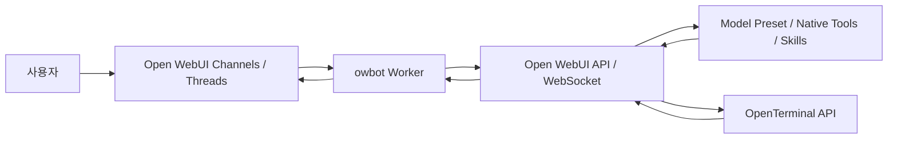

# openwebui-bot

Open WebUI 채널에서 `@TEAM-BOT`을 멘션하면 최근 채널 문맥과 현재 스레드 문맥을 읽고 응답하는 외부 워커형 봇입니다.

이 저장소는 `Open WebUI 자체를 대체`하지 않습니다. Open WebUI는 사용자 포털과 채널 UI를 담당하고, 이 워커는 다음 역할만 맡습니다.

- 채널 websocket 이벤트 수신
- 현재 채널/스레드 문맥 수집
- Open WebUI `/api/chat/completions` 호출
- 최종 답변을 채널 또는 스레드에 다시 게시

## 핵심 동작

- 일반 질의는 `/api/chat/completions`의 일반 JSON 응답을 사용합니다.
- native tool / OpenTerminal / MCP 경로는 Open WebUI의 websocket `events` lifecycle을 사용합니다.
- 이 경우 워커는 실제 socket `session_id`와 임시 `chat_id` / `message_id`를 completion 요청에 함께 넣고, HTTP 본문이 아니라 websocket `events`에서 최종 답변을 회수합니다.

## 시스템 아키텍처

이 시스템은 `Open WebUI`, `외부 워커`, `OpenTerminal`의 세 층으로 나뉩니다.



역할 분리:

- `Open WebUI`
  - 사용자 로그인
  - 채널 / 스레드 UI
  - 모델 preset, builtin tools, native tool calling
  - terminal connection 관리
- `owbot Worker`
  - 채널 websocket 이벤트 수신
  - 멘션 판정
  - 채널 / 스레드 문맥 수집
  - Open WebUI completion 요청
  - 최종 응답을 다시 채널 / 스레드에 게시
- `OpenTerminal`
  - 별도 터미널 API 서버
  - 파일 읽기 / 쓰기 / 검색
  - 명령 실행과 상태 조회
  - skill이 참조하는 로컬 스크립트 실행 기반 제공

## OpenTerminal 연결 구조

중요한 점은 워커가 OpenTerminal에 직접 붙지 않는다는 것입니다.

실제 호출 경로:

1. 워커가 Open WebUI에 `terminal_id`를 포함해 `/api/chat/completions` 요청
2. Open WebUI가 `terminal_id`에 매핑된 terminal connection 설정 조회
3. Open WebUI가 그 connection의 `url`로 OpenTerminal API 호출
4. 결과를 Open WebUI native tool lifecycle에 반영
5. 워커는 websocket `events`에서 최종 답변을 회수

즉:

- `OPENWEBUI_TERMINAL_ID`
  - Open WebUI 안의 terminal connection 레코드 id
- terminal connection `url`
  - 실제 OpenTerminal API 서버의 base URL
- 워커
  - `url`을 직접 쓰지 않음
  - `terminal_id`만 사용

Open WebUI 프록시에서 확인할 수 있는 대표 엔드포인트:

- `/api/v1/terminals/{terminal_id}/api/config`
- `/api/v1/terminals/{terminal_id}/files/cwd`
- `/api/v1/terminals/{terminal_id}/ports`

OpenTerminal 자체가 노출하는 대표 API:

- `/openapi.json`
- `/execute`
- `/execute/{process_id}/status`
- `/files/list`
- `/files/read`
- `/files/grep`
- `/files/write`
- `/files/replace`

## 로컬 검증과 운영 배포

이 저장소는 개발 중 로컬 환경에서 동작 검증할 수 있지만, 실제 운영은 별도 환경에서 다시 설정해야 합니다.

중요한 점:

- `.env.example` 값은 예시일 뿐이며, 로컬 테스트 값이나 특정 머신의 URL을 그대로 운영에 복사하면 안 됩니다.
- `OPENWEBUI_BOT_USER_ID`는 표시 이름이 아니라 Open WebUI 내부 사용자 id여야 합니다.
- Open Terminal URL은 `브라우저 기준`이 아니라 `Open WebUI 서버 프로세스 기준`으로 접근 가능해야 합니다.
- Docker, compose, 사내망 reverse proxy 환경에 따라 `localhost`가 의미하는 대상이 달라집니다.
- 중복 이벤트 저장소는 기본적으로 7일 보관 후 1시간마다 만료 정리를 수행합니다.

운영 전에는 반드시 [runbook.md](/Users/julirsia/development/company/openwebui-bot/docs/runbook.md)를 기준으로 환경별 값으로 다시 채워야 합니다.

## 문서 안내

- [runbook.md](/Users/julirsia/development/company/openwebui-bot/docs/runbook.md)
  - 운영 환경 준비
  - 환경 변수 정의
  - Open Terminal / Tools 연결 체크리스트
  - 운영 배포 전 검증 순서
- [debugging.md](/Users/julirsia/development/company/openwebui-bot/docs/debugging.md)
  - 무응답, 멘션 미감지, tool 실패, terminal proxy 실패 디버깅
  - websocket `events` 기반 completion 확인 포인트

## 주요 파일

- [team_bot/config.py](/Users/julirsia/development/company/openwebui-bot/team_bot/config.py): 환경 변수 로딩과 검증
- [team_bot/openwebui_client.py](/Users/julirsia/development/company/openwebui-bot/team_bot/openwebui_client.py): Open WebUI REST / websocket 호출
- [team_bot/context_builder.py](/Users/julirsia/development/company/openwebui-bot/team_bot/context_builder.py): 채널 문맥 구성
- [team_bot/worker.py](/Users/julirsia/development/company/openwebui-bot/team_bot/worker.py): 이벤트 수신, completion 실행, 응답 게시
- [team_bot/state.py](/Users/julirsia/development/company/openwebui-bot/team_bot/state.py): 중복 처리 방지와 만료 정리

## 빠른 로컬 검증

```bash
python3 -m venv .venv
. .venv/bin/activate
pip install -r requirements.txt
cp .env.example .env
python -m team_bot.main
```

워커가 떠 있는 상태에서 채널 / 스레드 E2E 검증을 자동으로 돌리려면:

```bash
. .venv/bin/activate
OPENWEBUI_BASE_URL="http://localhost:3000" \
OPENWEBUI_BOT_EMAIL="bot@bot.com" \
OPENWEBUI_BOT_PASSWORD="bot" \
OPENWEBUI_BOT_USER_ID="actual-bot-user-id" \
OPENWEBUI_BOT_DISPLAY_NAME="TEAM-BOT" \
OPENWEBUI_FORCE_NATIVE_FUNCTION_CALLING="true" \
OWBOT_TEST_USER_EMAIL="worker-test-user@local.test" \
OWBOT_TEST_USER_PASSWORD="bot" \
OWBOT_TEST_SKILL_NAME="terminal-file-check" \
OWBOT_TEST_SKILL_EXPECTED_TEXT="TERMINAL_SKILL_OK" \
python scripts/run_channel_e2e.py
```

`OWBOT_TEST_SKILL_NAME`을 주면 E2E가 `$스킬` 호출까지 같이 검증합니다. `OWBOT_TEST_SKILL_EXPECTED_TEXT`를 함께 주면 단순 응답이 아니라 스킬이 실제로 만든 결과 문자열까지 검사합니다.

이 단계는 어디까지나 `동작 검증용`입니다. 실제 운영은 대상 환경에서 Open WebUI URL, 봇 계정, 모델 id, terminal id, network topology를 기준으로 다시 설정해야 합니다.
