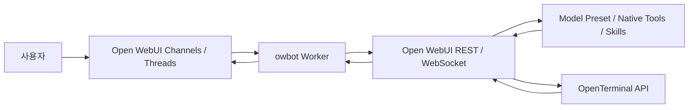

# TEAM-BOT Architecture

## 1. 목적

이 문서는 `owbot`의 시스템 구성과 요청 흐름을 설명합니다.

이 저장소의 역할은 다음 하나입니다.

- Open WebUI 채널 / 스레드에서 호출되는 봇 오케스트레이션

이 저장소는 Open WebUI를 대체하지 않습니다. 사용자 포털, 모델 preset, native tools, terminal connection 관리는 Open WebUI가 맡고, 이 워커는 채널 이벤트를 받아 completion을 실행하고 결과를 다시 게시합니다.

## 2. 구성 요소

### 사용자

- Open WebUI 채널 / 스레드에서 대화
- `@TEAM-BOT` 또는 실제 봇 표시 이름으로 멘션

### Open WebUI

- 사용자 인증과 권한 관리
- 채널 / 스레드 UI
- 모델 preset
- builtin tools / MCP / terminal connection / native function calling
- completion lifecycle과 websocket event 발행

### owbot Worker

- `events:channel` websocket 이벤트 수신
- 멘션 판정
- 최근 채널 / 스레드 문맥 조회
- Open WebUI completion 요청
- 최종 응답을 채널 또는 스레드에 다시 게시

### OpenTerminal

- 별도 API 서버
- 명령 실행
- 파일 목록 / 읽기 / 검색 / 쓰기
- skill이 참조하는 filesystem 스크립트 실행 기반

## 3. 주요 설계 원칙

### 3-1. Open WebUI 우선

워커는 Open WebUI를 우회하지 않습니다.

- 모델 선택은 Open WebUI preset 사용
- terminal 호출은 Open WebUI terminal connection 사용
- native tool lifecycle은 Open WebUI websocket event 사용

### 3-2. 채널 문맥은 워커가 조합

워커는 아래 문맥을 수집해 단일 프롬프트로 만듭니다.

- 최근 채널 메시지
- 현재 스레드 루트와 답글
- 현재 호출 메시지

### 3-3. tool / terminal / skill은 Open WebUI가 실행

워커는 도구를 직접 실행하지 않습니다.

- 워커는 `terminal_id`, `skill_ids`, `tool_ids` 같은 설정만 completion payload에 포함
- 실제 실행은 Open WebUI가 수행
- 워커는 websocket completion event에서 최종 텍스트를 회수

## 4. 요청 흐름

### 4-1. 일반 질의

1. 사용자가 채널 또는 스레드에서 봇 멘션
2. 워커가 이벤트를 받고 멘션 여부 판단
3. 워커가 최근 채널 / 스레드 문맥 조회
4. 워커가 `/api/chat/completions` 호출
5. 일반 JSON 응답에서 최종 텍스트 추출
6. 채널 또는 스레드에 답변 게시

### 4-2. tool / terminal / skill 질의

1. 사용자가 채널 또는 스레드에서 봇 멘션
2. 워커가 문맥 조회
3. 워커가 `/api/chat/completions` 호출
4. 이때 아래를 함께 보냄
   - `session_id`
   - 임시 `chat_id`
   - 임시 `message_id`
   - 필요 시 `terminal_id`, `skill_ids`, 기타 tool 설정
5. Open WebUI가 native tool lifecycle 시작
6. Open WebUI가 websocket `events`로 `chat:completion`, `chat:active` 등을 발행
7. 워커가 최종 assistant 텍스트를 회수
8. 채널 또는 스레드에 답변 게시

## 5. OpenTerminal 연결 구조

가장 많이 헷갈리는 부분입니다.

워커는 OpenTerminal에 직접 붙지 않습니다.

실제 구조:

- 워커가 사용하는 값: `OPENWEBUI_TERMINAL_ID`
- Open WebUI가 가지고 있는 값: terminal connection `url`
- 실제 OpenTerminal API 서버: terminal connection `url`이 가리키는 대상

즉 호출 순서는 다음과 같습니다.

1. 워커 -> Open WebUI: `terminal_id` 포함 completion 요청
2. Open WebUI -> terminal connection 조회
3. Open WebUI -> connection `url`로 OpenTerminal API 호출
4. Open WebUI -> websocket `events`로 결과 반영
5. 워커 -> 최종 텍스트를 채널에 게시

### 5-1. Open WebUI 프록시 API

운영 점검 시 가장 먼저 보는 경로:

- `/api/v1/terminals/{terminal_id}/api/config`
- `/api/v1/terminals/{terminal_id}/files/cwd`
- `/api/v1/terminals/{terminal_id}/ports`
- `/api/v1/terminals/{terminal_id}/openapi.json`

### 5-2. OpenTerminal 자체 API

실제 OpenTerminal 서버가 제공하는 대표 경로:

- `/openapi.json`
- `/execute`
- `/execute/{process_id}/status`
- `/files/list`
- `/files/read`
- `/files/grep`
- `/files/write`
- `/files/replace`

## 6. skill 동작 구조

skill은 두 층으로 구성될 수 있습니다.

### 6-1. Open WebUI native skill

- 모델 preset에 연결되는 skill 메타
- `$skill-name` 형태로 프롬프트 안에서 호출될 수 있음

### 6-2. OpenTerminal filesystem skill

- OpenTerminal 작업 디렉터리 아래의 skill 폴더와 스크립트
- 예: `/home/user/SKILL/terminal-file-check`
- skill 문서가 `./scripts/echo_skill.sh` 같은 로컬 스크립트를 참조할 수 있음

즉 skill 검증은 다음 둘 다 봐야 합니다.

- Open WebUI가 그 skill을 알고 있는지
- OpenTerminal 쪽 filesystem/script가 실제 존재하는지

## 7. 배포 토폴로지별 terminal URL 예시

### Docker에서 Open WebUI가 컨테이너일 때

- `http://localhost:8000`은 대개 잘못됨
- 보통 `http://host.docker.internal:8000` 또는 컨테이너 간 서비스명 사용

### docker compose 네트워크

- `http://open-terminal:8000` 같은 서비스명 사용 가능

### bare metal / 같은 VM

- Open WebUI와 OpenTerminal이 같은 호스트 프로세스로 떠 있으면 `http://localhost:8000` 가능

### reverse proxy 뒤 별도 도메인

- `https://open-terminal.company.internal`
- 반드시 Open WebUI 서버가 실제로 도달 가능한 주소여야 함

## 8. 운영 시 가장 중요한 사실

- 워커는 Open WebUI에 종속적입니다.
- terminal 성공 여부는 `terminal_id`보다 `connection url`이 더 중요합니다.
- skill 성공 여부는 Open WebUI 메타와 OpenTerminal filesystem이 둘 다 맞아야 합니다.
- tool / terminal / skill 경로는 HTTP 응답만 보면 안 되고 websocket completion event까지 봐야 합니다.
